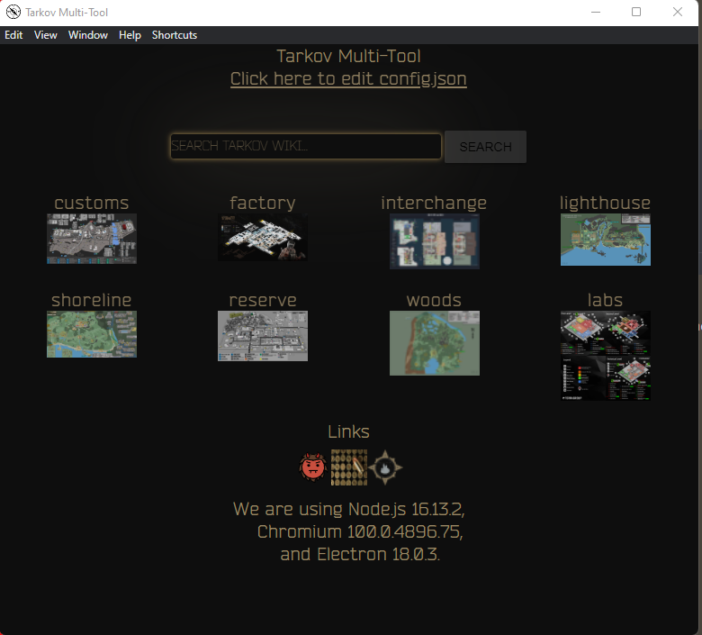

# tarkov-map-viewer
This is a nifty toolkit for playing tarkov.

- [tarkov-map-viewer](#tarkov-map-viewer)
- [Build](#build)
- [Usage](#usage)
- [Screenshots](#screenshots)

# Build

 - clone from git
 - run npm install
 - npm run start
 - npm run dist

# Usage
  Usage  
Just open and click

# Screenshots

